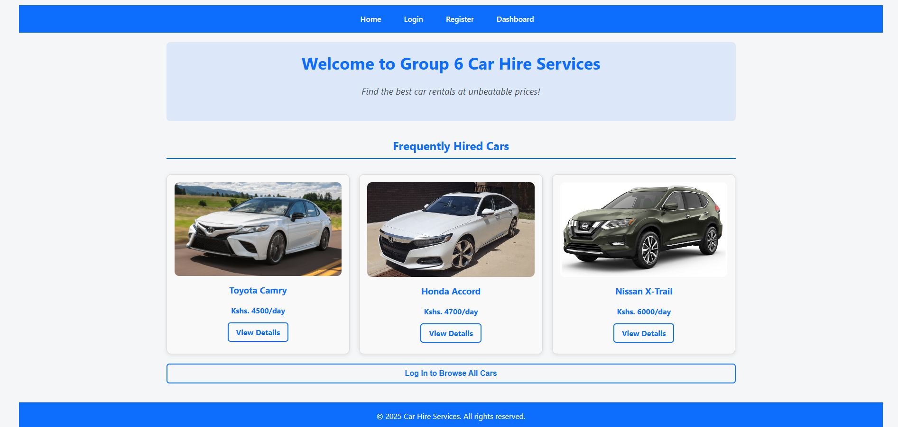
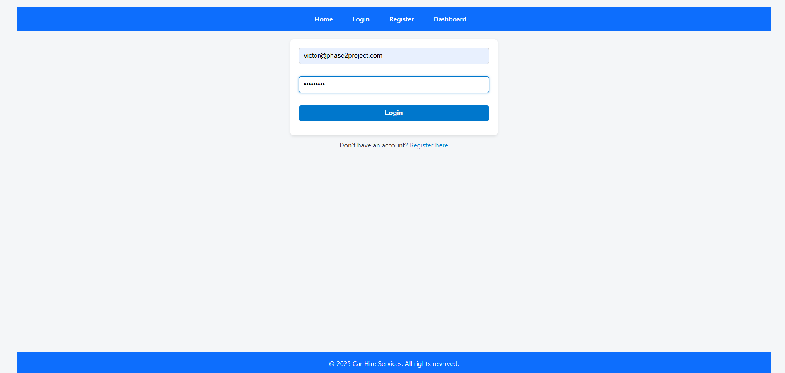
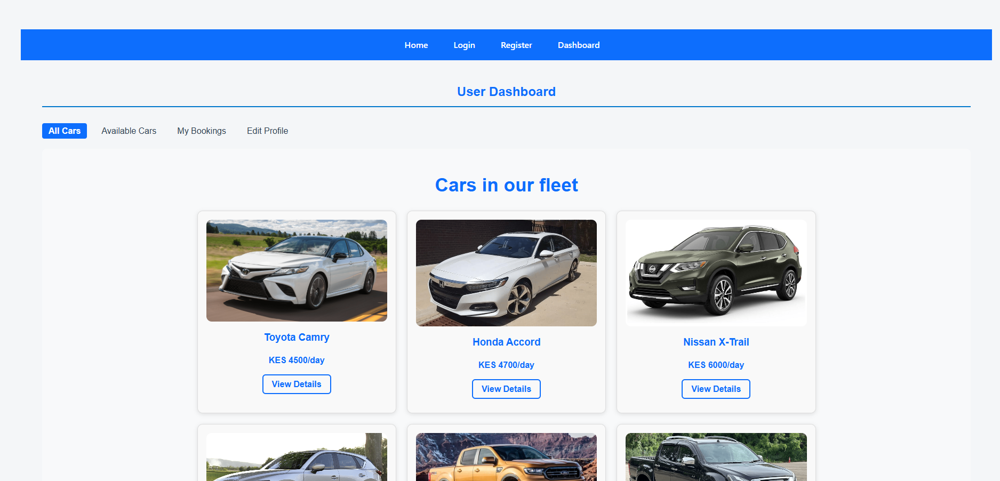
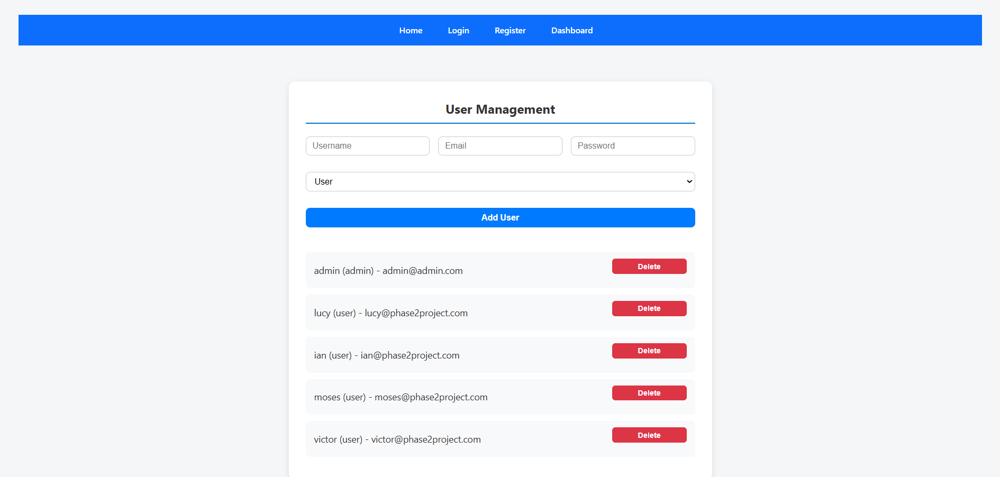
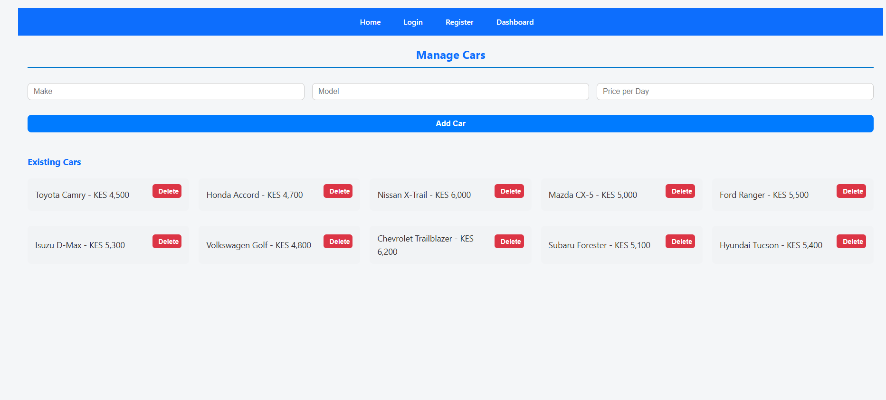

# Phase 2 Final Project: 🚗 Group 6 Car Hire React App 🚗

Phase 2 required us to work in groups, collaborating in building applications. Doing it for the first time this tests your patience and anger management skills 😂😂😂 but it was a worthy experience.

This is a user-friendly car hire web application built with **React**, **React Router**, and a mock REST API using **JSON Server** deployed on [Render](https://render.com/). This project was created as a school group assignment and demonstrates key full-stack concepts including authentication, routing, and CRUD operations.

---

## 🌐 Live Demo

🔗 [View Deployed App on Netlify](https://group-6-car-hire-react-app.netlify.app/)

---


## 🚀 Features

### ✅ Public Routes
- `/` – Home page
- `/login` – User login
- `/register` – User registration
- `/cars` – Fleet
- `/cars/:id` – Car details
- `/book/:id` – Booking form

### 🔒 Protected Routes (User Dashboard)
- `/dashboard` – Shows Available Cars (default)
- `/dashboard/all-cars` – View fleet of cars
- `/dashboard/available-cars` – View only available cars
- `/dashboard/bookings` – User's personal bookings
- `/dashboard/edit-profile` – Edit personal information

### 👑 Admin Routes (Admin Dashboard)
- `/admin/login` – Admin login
- `/admin/choice` – Admin dashboard entry
- `/admin/cars` – Manage cars (CRUD)
- `/admin/users` – Manage users

---

## 📦 Tech Stack

- **Frontend**: React (Vite), React Router and custom CSS
- **Backend (Mock)**: [Rest API](https://group-6-car-hire-react-app.onrender.com/)
- **Authentication**: localStorage
- **Deployment**: Netlify
- **Package Manager**: npm

---

## ⚙️ Installation Instructions

1. **Clone the repo**
   ```bash
   git clone git@github.com:Moringa-SDF-PT10/Group-6-car-hire-react-app.git

2. **Navigate into the repo**
   ```bash
   cd Group-6-car-hire-react-app
   ```
3. **Open VS Code and install dependencies**
   ```bash
   npm install
   ```
4. **Start development server**
   ```bash
   npm run dev
   ```
5. **Render Application on browser**
   ```bash
   http://localhost:5173/
   ```

---

## 📸 Screenshots

### Homepage  


### Login Page  


### Registration Page  


### User Dashboard  


### Admin Dashboard (users)


### Admin Dashboard (cars)



---


👨‍💻 **Contributors/Developers**

*Phase 2 Group 6 Members – Moringa School SDF-PT10*

---

## License

This project is licensed under the [MIT License](./LICENSE).
